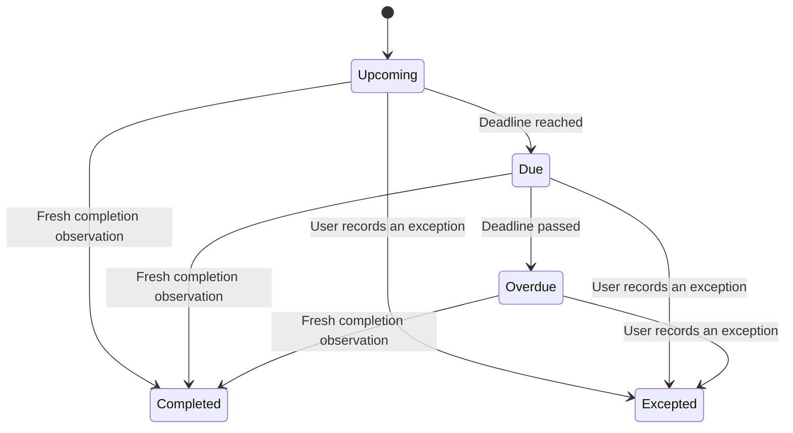

# Checkpoint reminders

Status: policy specification, 2026-09-05. Local reliability implementation and remaining platform gates are recorded in [the 2026-09-10 checklist](../plans/workday-companion-progress.md). The user chose gentle warnings with limited escalation. This specification owns reminder timing, completion, and recovery semantics; [CONTEXT](../../CONTEXT.md) owns terminology.

## Inputs and authority

Resolve each shift into actual start/end dates in an explicit work timezone, keyed by its work date. Resolve the break time relative to that shift, including the following calendar day for an overnight break. Reject a break outside the shift and ambiguous equal start/end times during setup. A weekly template and a dated shift instance are separate: working today cannot suppress next week's clock-in checkpoint.

The first version supports one planned main break with a configurable duration. Additional observed breaks still have return deadlines; associating them with the planned main break must be explicit if ambiguous. Paid/unpaid break policy and work-hours targets are user configuration, not inferred employer rules. A zero-duration setting disables the planned break rather than immediately declaring every break overdue.

Completion requires a fresh observation from Time Clock: active completes clock-in; an associated on-break transition completes the planned break-start checkpoint; leaving that break completes its return checkpoint; clocked-out completes clock-out. Schedule edits, notification clicks, and elapsed time do not confirm these actions. In version one, actions open the relevant website controls; the app does not silently clock the user in or out.

Early attendance counts from the start of the scheduled work date in the work timezone, retaining the one-hour pre-start window for shifts just after midnight. Only the selected shift receives that observation; off-day activity cannot complete a later work date. Once working has been observed, this shift's clock-in reminders stay canceled through temporary unavailable states and relaunch. A confirmed on-break state completes break-start even without a readable timer; return reminders wait for a known session start. A later break gets a separate return deadline. Clocking out after an observed session cancels all remaining attendance prompts for that shift, including snoozes and obsolete delivered notices.

## Recommended timing defaults

These exact intervals are recommendations for the pilot, not employer policy or individually confirmed user preferences.

| Checkpoint | Advance notice | Due moment | Follow-up if still actionable | Primary action |
|---|---|---|---|---|
| Clock in | 15 minutes before shift | Shift start | 5 and 15 minutes after due | Open Time Clock |
| Start planned break | 5 minutes before preferred break | Preferred break time | 5 and 15 minutes after due | Open Time Clock |
| Return from break | 5 minutes before return, only if the break is longer than 5 minutes | Observed break start + allowed duration | 2 and 5 minutes after due | Open Time Clock |
| Clock out | File report before shift end (saved advance lead) | Shift end | 5 and 15 minutes after due | Advance: Report; due: Time Clock, after filing report |
| Dashboard wrap-up | 30 minutes before shift end | File report, then clock out | No extra notification series | Open Report |

Each attendance checkpoint has at most one advance alert and three due/follow-up alerts. After that, keep the visible due state until resolved. Advance copy states the deadline; due copy states the action; overdue copy states elapsed lateness. “Past shift end” is distinct from “Hours target met.” A target-hours hint is quiet and is not another repeating overtime alarm.

Examples: “Break ends in 5 minutes · Return at 21:00”; “Clock-out due · Your shift ended at 00:00”; “Clock status unavailable · Check Time Clock before continuing.” Report content and CSM feedback never appear in notification previews.

## Checkpoint lifecycle

Snoozed-until, silenced, and unavailable clock data are attributes, not completion states. Keep the observed clock state and freshness separate so connectivity loss cannot be mistaken for attendance.

## Attention and action rules

- Offer the primary action first and one useful secondary action, “Snooze 5 min”. Additional durations belong in the popover. Apple may show only the first two category actions in limited space. [Apple category API](https://developer.apple.com/documentation/usernotifications/unnotificationcategory/init(identifier:actions:intentidentifiers:options:))
- Snooze moves the next eligible prompt to the chosen time and coalesces intervening prompts. It preserves the original due time and the per-checkpoint alert budget; it never creates an unrelated notification. Recompute relative copy at delivery where the app controls delivery; pending fallback text uses an absolute deadline.
- “Silence this reminder” stops app-owned playback and remaining audible prompts for that checkpoint. Keep the due row, with Resume reminders available. Dismissing a banner does not change attendance.
- At one instant, show one primary due item. Prefer the earliest overdue attendance deadline; a break return outranks a simultaneous planned-break prompt. An active break return stays primary; the advance clock-out reminder opens Report before the due attendance reminder. Snoozing one checkpoint does not silently suppress a different deadline.
- Completed or excepted checkpoints cancel their pending prompts and snoozes and remove obsolete delivered notices. Repeated observations are idempotent.
- Use short system-managed sounds by default. Preserve existing selected sounds during migration. An optional app alarm can be designed later with a visible stop control and explicit enablement; ordinary notifications should not start independent long playback merely because the app is foreground.

## Recovery and notification coverage

Persist checkpoint identity, due dates, revision, follow-up budget, snooze/silence, and completion/exception evidence. Reconcile on launch, wake, reconnect, fresh observation, preferences change, and significant date/time/timezone change. Use a single serialized reconciliation path and cancel an older generation's pending work before accepting new scheduling results.

On wake after multiple deadlines, first refresh the clock. Show the most urgent still-actionable checkpoint and a compact missed-events summary. Discard obsolete advance notices; never replay the full backlog. A launch after shift start should still surface a due clock-in checkpoint if fresh state is clocked out.

When state is unavailable, show “Check Time Clock” and the last successful observation time. Preserve the planned deadline, but stop assertions such as “You are still on break.” A locally extrapolated countdown must be labeled estimated. DOM-read time and confidence in the remote state must not be represented as equivalent freshness.

Queue a bounded horizon of dated local notifications so schedule-based prompts can survive app termination. The OS cannot ask a terminated app to revalidate its clock state before every local delivery. Consequently, prequeued fallbacks say “Check your clock-out · Scheduled end 00:00” rather than asserting a missed clock-out; reliable completion-aware cancellation needs the app running and observing. Do not queue weeks of state-specific “still working” assertions.

The app does not promise to wake a sleeping Mac or override user notification/Focus choices. Onboarding checks authorization and sound settings, offers a real test notification in Release builds, and distinguishes “scheduled successfully” from “user confirmed receipt.” Users control which apps and time-sensitive notifications Focus permits. [Apple Focus guidance](https://support.apple.com/guide/mac-help/set-up-a-focus-to-stay-on-task-mchl613dc43f/mac)

Diagnostics show the next pending checkpoint, last reconciliation, permission status, and the last scheduling error. Keep a bounded local history of scheduling decisions without report content or credentials. Consider time-sensitive delivery only for immediate attendance deadlines after platform verification; it remains a user-controlled option.

## Acceptance scenarios

| Scenario | Required result |
|---|---|
| Clock in before the advance warning | Cancel this shift's clock-in prompts; retain the next shift's plan |
| Clock in at 12:00 for a 14:50 shift | Complete today's clock-in even more than an hour early; no 14:50 alert after restart |
| Already on break with an unreadable timer | Cancel start-break alerts immediately; wait for a valid timer before planning return |
| Return from break before its deadline | Cancel break-return alerts and snoozes; retain clock-out reminders |
| Snooze clock-out, then clock out | Pending snooze and due alerts disappear; Today checks File report for that shift using the user-confirmed website prerequisite |
| Clocked out at preferred break time | No claim that a break must start; show the actual next actionable checkpoint |
| Main break completed before its preferred time | The associated planned-break checkpoint stays complete after resume/restart |
| Break begins at 20:02:45 for 60 minutes | Due at 21:02:45; elapsed seconds do not round the deadline forward |
| Break duration changes or an unreadable timer appears | Reconcile from known session evidence; unknown duration never becomes zero elapsed |
| Monday 22:00–Tuesday 06:00, break at 02:00 | All checkpoints belong to Monday's shift; break falls on Tuesday |
| Work timezone has a DST gap or overlap | Apply a documented calendar policy and show the resolved date/time; test both transitions |
| Repeated schedule edits with delayed callbacks | Only the latest revision's requests remain |
| Sleep through the break return deadline | Refresh on wake; one current reminder, no stale warning cascade |
| Login expiry, offline transition, stale timer, or invalid DOM | Visible verification state; no invented attendance completion |
| End-of-week overnight shift crosses into a day off | Evaluate the active shift's work date, not only the current weekday |
| All notifications disabled | Today still shows due checkpoints and how to restore notification coverage |
| App terminates; user clocks out elsewhere | Any remaining fallback asks to check the scheduled deadline; it does not assert current attendance |

Implement these as deterministic planner/reconciler tests where possible. Verify banner actions, sound, foreground/background delivery, Focus, sleep/wake, and restart on a real Mac; planner tests cannot prove those services.

## Local sound implementation — 2026-09-10

Ordinary bundled clips now last ten seconds. Settings can opt into twenty-second variants for overdue break-return and clock-out stages; normal advance and due alerts remain ten seconds. Tone selections are preserved. Preview/test buttons for Over Break and Clock Out follow the longer-sound setting, and snoozes retain the selected duration. macOS controls actual playback length and presentation. Time Sensitive delivery remains deferred until developer signing and physical verification are available.
